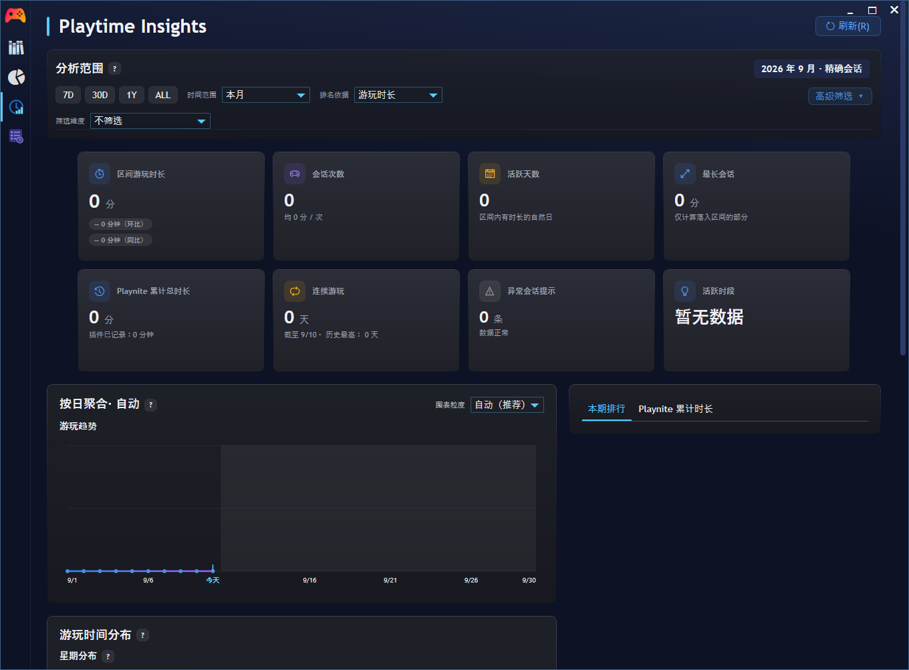
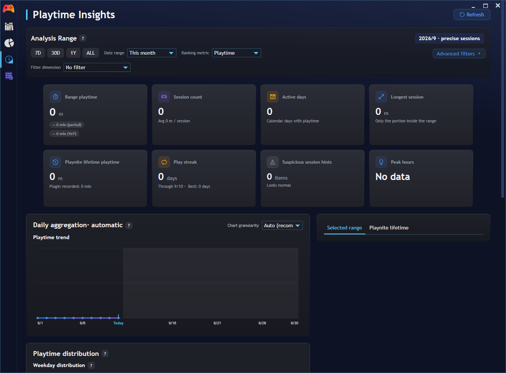
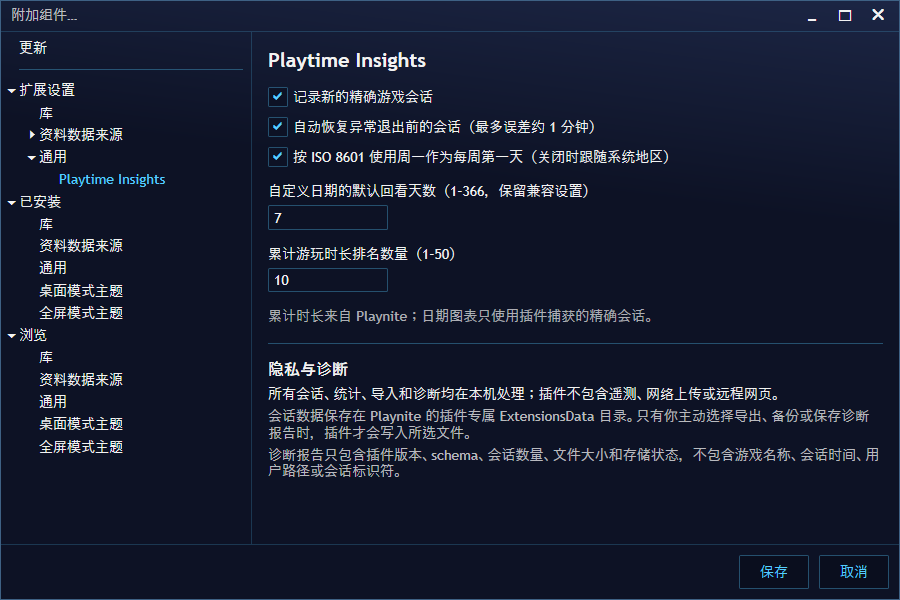

# Playtime Insights

Playtime Insights 是一个面向 Playnite Desktop 的本地游玩时间分析插件，在 Playnite 客户端内提供原生 WPF 仪表盘和会话管理页面：记录精确到秒的游戏会话，按日、周、月、年或自定义范围分析游玩时间，并提供趋势、热力图、时间分布和游戏排名。

插件完全本地运行：不包含遥测，不上传游戏库或会话数据，也不依赖远程网页。

**当前版本：`1.0.0`** · 作者：[SHINKU1506](https://github.com/SHINKU1506) · [GitHub Releases](https://github.com/SHINKU1506/PlaytimeInsights/releases) · [变更日志](CHANGELOG.md) · [隐私说明](PRIVACY.md)

> 当前开发分支已经完成下一轮 Dashboard 视觉增强，但尚未进行正式 1.1.0 发版。公开安装包、版本号和 GitHub Release 仍以 1.0.0 为准；开发分支的验收进度见 [Client Acceptance 1.1.0](docs/CLIENT_ACCEPTANCE_1.1.0.md)。

## 目录

- [界面预览](#界面预览)
- [主要功能](#主要功能)
- [数据口径](#数据口径)
- [系统与兼容性](#系统与兼容性)
- [安装与升级](#安装与升级)
- [基本使用](#基本使用)
- [数据、隐私与诊断](#数据隐私与诊断)
- [已知限制](#已知限制)
- [从源码构建](#从源码构建)
- [项目文档](#项目文档)
- [问题反馈](#问题反馈)
- [License](#license)

## 界面预览

以下截图来自 0.9.8 发布周期，用于展示插件的基本页面结构。当前开发分支已完成 Dashboard 视觉增强；新版截图将在正式 1.1.0 发版时更新。

### 分析页 · 中文



### 分析页 · English



### 插件设置 · 中文



## 主要功能

### 会话记录

- 监听游戏开始和停止事件，记录精确到秒的本地会话；
- 运行中每分钟保存恢复检查点，支持 Playnite 异常退出后的会话恢复。

### 数据分析

- 支持今天、本周、本月、本年和自定义日期范围，可自动或手动选择日、周、月、年聚合粒度；
- 使用单一响应式面板展示 8 张概览卡，并根据可用内容宽度在单栏和双栏 Dashboard 间稳定切换；
- 概览卡包含区间时长、会话数、活跃天数、最长会话、累计总时长、连续游玩、异常提示和峰值时段；平均会话可作为排行榜指标并在排行 Tooltip 中查看；
- 自适应折线/面积趋势图，支持时长纵轴、稀疏日期标签、Crosshair、Tooltip 和会话下钻；
- 日历热力图使用固定的 0、低于 1 小时、1–3 小时、超过 3 小时四档绝对时长语义；同时提供星期分布、24 小时分布和星期 × 小时相对热力图；
- 趋势周期与日历日期的会话明细分别紧邻触发图表展开，保留分页和 Recycling 虚拟化；
- 按时长、会话次数、活跃天数、平均会话或最长会话进行区间游戏排名；
- 独立显示 Playnite 所有游戏的累计时长与累计排名；排行包含本地游戏封面、前三名勋章、整行时长占比背景，以及汇总占比、平均会话和最长会话的结构化 Tooltip；
- 按库来源、Playnite 来源、开发者、发行商、类型、标签、分类和安装状态筛选。

### 会话管理

- 原生会话管理：搜索、筛选、补录、编辑、软删除和恢复；
- JSON/CSV 导入、导出与预览，兼容部分 GameActivity 会话文件；
- 完整备份、备份恢复和存储索引重建，危险操作前自动创建回滚备份；
- 大型会话列表分页与 Recycling 虚拟化。

### 可用性

- 中文和英文界面、键盘导航、访问键及屏幕阅读器名称；
- 日历热力格使用可聚焦按钮并支持键盘触发；界面动效遵循 Windows 减弱动画设置。

## 数据口径

| 内容 | 数据来源 | 说明 |
|---|---|---|
| 累计总时长、累计排名 | Playnite `Game.Playtime` | 包含安装插件前已有的累计值 |
| 日期范围、趋势、热力图、时间分布 | 插件精确会话 | 只包含插件记录或用户导入的会话 |
| 会话次数、平均/最长会话、连续游玩 | 插件精确会话 | 不会把未知历史累计时长伪造成历史会话 |

Playnite 的累计时长以分钟为主要展示单位，插件会话内部保存秒数，因此极短会话或四舍五入边界上可能出现约一分钟的展示差异。这属于统计口径差异，不代表会话丢失。

## 系统与兼容性

- 平台：Playnite Desktop / Windows；
- 运行时：.NET Framework 4.6.2；
- SDK：Playnite SDK / API 6.16.0 或更高兼容版本；
- Fullscreen：当前不提供 Playnite Fullscreen 专用页面。

插件界面使用 Playnite 公共主题资源，并已在默认主题和 Seaside 深色主题下进行兼容检查。

## 安装与升级

1. 从 [GitHub Releases](https://github.com/SHINKU1506/PlaytimeInsights/releases) 下载 `.pext` 安装包；
2. 在 Playnite 中打开安装包并按提示完成安装；
3. 安装或升级后重启 Playnite；
4. 从 Desktop 侧边栏打开“Playtime Insights”和“Playtime Insights · 会话”。

升级时保持相同插件 ID，现有会话、设置和备份会继续保存在插件专属数据目录。建议在重大升级前先从会话页的“高级选项”创建一次完整备份。

## 基本使用

### 分析页

- 选择时间范围、聚合粒度、排名依据和元数据筛选；
- 将鼠标悬停在趋势或热力图上查看精确数值；日历图例使用固定时长档位，星期 × 小时热力图使用当前范围内的相对强度；
- 点击趋势周期或日历热力格后，会话明细会紧邻相应图表展开；
- 排行榜整行浅蓝背景始终表示时长占比，即使当前按会话次数或活跃天数排序；悬停行可查看占比、平均会话和最长会话；
- 点击星期分布可筛选下方 24 小时分布，再次点击恢复全部星期。

### 会话页

- 左侧主按钮用于导入及导出当前筛选结果；
- “高级选项”包含软删除/恢复、完整备份、备份恢复、重建索引和诊断报告；
- 导入会先生成预览并检查无效项和重复项；
- 删除采用软删除，勾选“包含已删除”后可以恢复。

## 数据、隐私与诊断

会话数据默认保存在：

```text
%AppData%\Playnite\ExtensionsData\
  7094cd6b-d3a4-41d0-b7c3-f0cc535a9efd\
```

- 所有统计、导入和诊断都在本机完成；
- 插件没有遥测、账户系统或网络上传；
- 只有在用户主动导出、备份或保存诊断报告时，才会写入用户选择的路径；
- 诊断报告不包含游戏名称、会话时间、用户路径、游戏 ID 或会话 ID；
- 完整隐私说明见 [PRIVACY.md](PRIVACY.md)。

## 已知限制

- 插件无法从 Playnite 累计时长还原安装前的逐次历史会话；
- 异常退出恢复精度受一分钟检查点间隔限制；
- 会话存储使用本地 JSON，文件体积会随会话数量增长；
- All Sessions 跨越多年时，日历热力图会一次创建全部可交互格子；极长历史范围可能出现可感知的刷新停顿，后续将评估虚拟化或分段呈现；
- 下一轮 Dashboard 视觉增强的完整主题、DPI、减弱动效和实际读屏器矩阵仍在验收，不作为当前 1.0.0 公开版本的完成声明；
- Fullscreen 模式尚无专用统计界面；
- Playnite Add-on Database 收录清单已通过 [PR #626](https://github.com/JosefNemec/PlayniteAddonDatabase/pull/626)
  提交，需等待上游审核合并后才会出现在内置浏览器中。

## 从源码构建

需要安装 .NET Framework 4.6.2 Developer Pack，并提供 Playnite 安装目录：

```powershell
dotnet build PlaytimeInsights.sln -c Release `
  -p:PlayniteInstallDir="<Playnite 安装目录>"
```

运行回归测试：

```powershell
dotnet run --project Tests\PlaytimeInsights.Tests.csproj -c Release `
  -p:PlayniteInstallDir="<Playnite 安装目录>"
```

使用 Playnite 自带 Toolbox 打包：

```powershell
& "<Playnite 安装目录>\Toolbox.exe" pack `
  .\bin\Release\net462 `
  .\dist
```

## 项目文档

- [版本路线](docs/ROADMAP.md)
- [开发与技术实现](docs/DEVELOPMENT.md)
- [当前实现状态](docs/IMPLEMENTATION_STATUS.md)
- [架构重构计划](docs/ARCHITECTURE_OPTIMIZATION_PLAN.md)
- [架构重构行为基线](docs/ARCHITECTURE_REFACTOR_BASELINE.md)
- [新版本预发布流程](docs/PRE_RELEASE_WORKFLOW.md)
- [发布检查清单](docs/RELEASE_CHECKLIST.md)
- [0.9.8 客户端验收](docs/CLIENT_ACCEPTANCE_0.9.8.md)
- [1.0.0 客户端验收](docs/CLIENT_ACCEPTANCE_1.0.0.md)
- [1.1.0 Dashboard 视觉增强验收](docs/CLIENT_ACCEPTANCE_1.1.0.md)
- [Dashboard 视觉增强实施计划](docs/superpowers/plans/2026-08-17-dashboard-visual-elevation-implementation.md)
- [1.0.0 正式发布就绪审查](docs/RELEASE_READINESS_1.0.md)
- [1.0.0 发布说明](docs/RELEASE_NOTES_1.0.0.md)
- [0.9.8 发布说明](docs/RELEASE_NOTES_0.9.8.md)
- [变更日志](CHANGELOG.md)

## 问题反馈

请通过 [GitHub Issues](https://github.com/SHINKU1506/PlaytimeInsights/issues) 提交问题。建议附上：

- Playnite 版本、语言和主题；
- Playtime Insights 版本；
- 复现步骤和截图；
- 必要时附上由插件生成的不含会话明细的诊断报告。

请不要公开上传 `sessions.json`、完整备份或包含私人游戏库信息的日志。

## License

Playtime Insights 使用 [MIT License](LICENSE)。
