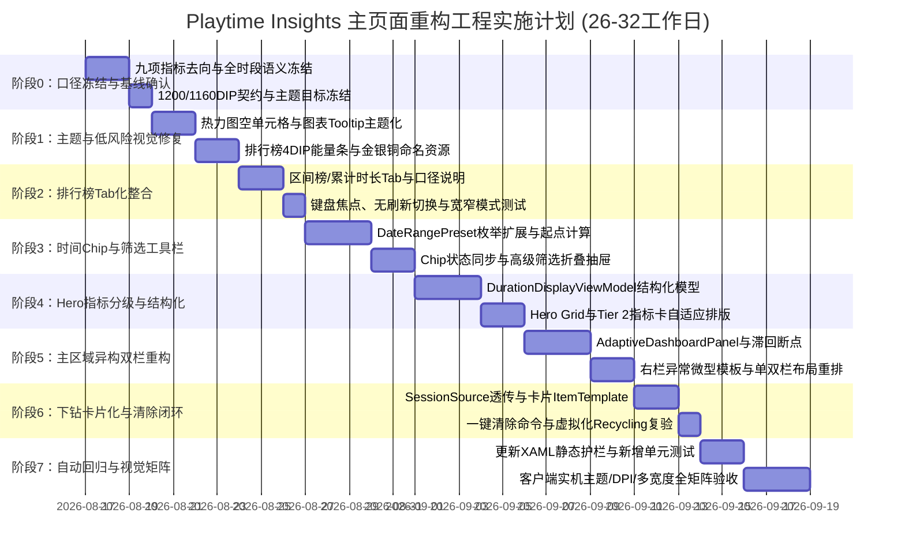

# Playtime Insights 主页面视觉重构与技术路线文档

**文档版本**：v1.1（复审定稿）<br>
**制定日期**：2026-08-14<br>
**审查基准**：严格依据 `docs/DASHBOARD_VISUAL_REFACTOR_ROADMAP_REVIEW.md` 审查结论修订<br>
**实施补充**：`docs/superpowers/plans/2026-08-14-dashboard-visual-refactor-implementation.md`<br>
**目标范围**：主分析仪表盘（`PlaytimeInsightsDashboardView`）、核心自定义控件、数据投影模型与视觉资产体系<br>
**工程预算**：26–32 个工程日（8 个阶段）+ 独立客户端实机视觉矩阵验收<br>
**设计目标**：在 100% 保持现有性能预算、主题兼容与统计口径的前提下，将主页面从现有的“单列垂直长卡片堆叠”重构为**现代化、宽屏自适应、主次分明、微质感精致**的专业游戏数据仪表盘。

---

## 1. 现状评估与重构驱动力

### 1.1 现状优势（继承与守底线原则）
- **高性能原生渲染**：完全基于 WPF 原生控件体系与自主实现的 `DrawingContext` 绘图，无重型第三方控件库负担；
- **清晰的 MVVM 解耦**：`DashboardViewModel` 细分 `Filter` / `Metrics` / `Distribution` / `Drilldown` 4 个子模块，选择性刷新架构严谨；
- **深度主题兼容基底**：广泛使用 Playnite `DynamicResource`（`TextBrush`, `ControlBackgroundBrush`, `PanelSeparatorBrush`, `PopupBackgroundBrush`, `GlyphBrush` 等）；
- **成熟的下钻与联动机制**：支持点击趋势点、热力图格子、星期柱状图即时过滤与下钻会话明细；
- **稳定的自动化回归基线**：当前 Release 构建 0 警告 0 错误，108/108 回归全部通过，10 万会话分析基线 635 ms，schema 4 加载基线 1,174 ms。

### 1.2 核心痛点与审查发现的关键问题
1. **单列长堆叠导致宽屏利用率低下**：
   - 8~9 个大号 `Border` 容器纵向无休止串联，在主流 1080p/2K/4K 宽屏下横向大面积留白，纵向用户需滚屏多次才能看到排行榜；
2. **信息层级缺乏主次（Visual Hierarchy）**：
   - 9 张指标卡片尺寸与权重一律均等，核心 KPI（总时长、会话数）无法作为 Hero 视觉锚点脱颖而出；
   - 图标裸露放置右上角，缺乏彩色半透明微质感底座；
3. **数据语义与领域模型依赖遗漏（审查重点修正）**：
   - 快捷时间 Chips 涉及新增 `DateRangePreset` 枚举、全时段起点语义、自动聚合规则，非纯 XAML 改造；
   - 数字与单位拆分必须在 ViewModel 层提供结构化展示模型，严禁在 XAML 中解析格式化字符串；
   - 下钻会话来源彩色 Tag 依赖 `SessionDetailViewModel` 透传真实的 `SessionSource` 枚举；
4. **硬编码颜色与浅色主题隐患**：
   - 热力图空单元格（`#FF2A2A2E`）、趋势图 Tooltip 弹窗（`#DC23252C`）等存在写死暗色，在 Playnite 浅色主题下出现明显对比度瑕疵；
5. **空间冗余与交互闭环缺失**：
   - “区间排行榜”与“累计总时长排行榜”纵向重复占地，需合并为单面板 Tab 切换并明确口径；
   - 点击下钻后展开的会话明细缺乏吸顶的“清除筛选/收起”按钮。

---

## 2. 目标架构与布局设计

### 2.1 整体布局蓝图：基于内容区 DIP 的响应式 2 栏网格（Adaptive 2-Column Grid）

断点统一定义为 **Dashboard 内部内容区的设备独立像素（DIP）**，不使用系统外框物理像素。双栏采用滞回阈值：内容区从窄变宽时在 **1200 DIP** 进入双栏，从宽变窄时在 **1160 DIP 以下**退出双栏，避免临界宽度反复切换。双栏间距固定为 **18 DIP**，右侧栏比例固定为 **0.38**。

- **宽屏模式（已进入双栏且内容区宽度 $\ge$ 1160 DIP）**：启用 62% 左主栏 + 38% 右侧栏异构双栏；
- **单栏模式（尚未进入双栏且内容区宽度 $< 1200 DIP$，或宽屏回缩至 $< 1160 DIP$）**：降级为单列源顺序流，所有模块完整可访问，无全局横向溢出。

```
┌────────────────────────────────────────────────────────────────────────────────────────┐
│ 1. 顶部控制栏 (Header & Toolbar): 标题 + 快捷时间芯片 (7D/30D/1Y/ALL) + 刷新 + 筛选器抽屉 │
├────────────────────────────────────────────────────────────────────────────────────────┤
│ 2. 核心 KPI 仪表层:                                                                    │
│    [ ⭐ Hero: 区间总游玩时长 ]  [ ⭐ Hero: 区间会话数 ]                                    │
│    [ 活跃天数 ] [ 平均会话 ] [ 最长会话 ] [ 累计总时长 ] [ 最长连续 ] [ 当前连续 ] [ 异常会话 ] │
├───────────────────────────────────────────┬────────────────────────────────────────────┤
│ 3. 左主栏 (Primary Area, ~62% 宽度):       │ 4. 右侧栏 (Secondary Area, ~38% 宽度):     │
│ ┌───────────────────────────────────────┐ │ ┌────────────────────────────────────────┐ │
│ │ 📈 游玩趋势图 (Adaptive Trend Chart)   │ │ │ 🏆 游戏排行榜 (Rankings Module)        │ │
│ │    [日 | 周 | 月 粒度内嵌切换 Tab]     │ │ │    [Tab: 本期排行 ┃ Playnite 累计时长] │ │
│ └───────────────────────────────────────┘ │ │    [前三名微质感奖牌 + 4 DIP 细能量条]   │ │
│ ┌───────────────────────────────────────┐ │ └────────────────────────────────────────┘ │
│ │ 🗓️ 日历热力图 / 时段分布联动卡片       │ │ ┌────────────────────────────────────────┐ │
│ │    [星期分布 ↔ 24小时分布联动强化]    │ │ │ ⚠️ 异常会话微卡片 (条件显示/自适应模板)  │ │
│ └───────────────────────────────────────┘ │ └────────────────────────────────────────┘ │
│ ┌───────────────────────────────────────┐ │                                            │
│ │ 🔍 选中时段下钻明细 (Session Details) │ │                                            │
│ │    [卡片化列表 + 来源Tag + ✕ 清除]    │ │                                            │
│ └───────────────────────────────────────┘ │                                            │
└───────────────────────────────────────────┴────────────────────────────────────────────┘
```

### 2.2 WPF 响应式布局实现机制
- **专用 Panel 维护主区域布局状态**：新增 `Controls/AdaptiveDashboardPanel.cs`，由 Panel 根据 `MeasureOverride` 获得的内容宽度维护只读 `IsWideLayout`，实现 1200/1160 DIP 滞回；
- **状态不侵入 ViewModel**：布局断点与实际宽度不引入业务 ViewModel，也不触发分析刷新；
- **左右栏独立纵向堆叠**：子模块通过 `AdaptiveDashboardPanel.Zone="Primary|Secondary"` 指定区域，宽屏时两栏分别累加高度，窄屏时恢复 XAML 源顺序，避免普通 Grid 共享行高造成空白；
- **Hero 独立响应**：两张 Hero 卡不进入主区域 Panel；`PlaytimeInsightsDashboardView.xaml.cs` 仅维护 640 DIP 的 `IsCompactHeroLayout`，用于 Hero 单行/双行切换；
- **异常列表微型化模板**：宽屏下右栏中的异常列表使用专用卡片模板，移除原全宽表格的 `MinWidth="760"` 限制。

---

## 3. 详细技术方案与改进规范

### 3.1 模块 1：顶部控制栏与快捷时间 Chips

#### 1. 数据模型与枚举扩展
在 `DateRangePreset` 枚举中新增明确项：
```csharp
public enum DateRangePreset
{
    Today,
    Last7Days,    // 新增：近 7 天（Day 聚合）
    Last30Days,   // 新增：近 30 天（Day 聚合）
    ThisWeek,
    ThisMonth,
    ThisYear,     // 本年（Month 聚合）
    AllSessions,  // 新增：全时段（当前筛选下最早有效会话至今天）
    Custom
}
```

#### 2. 全时段（AllSessions）数据语义规范
- 明确起点为“当前数据及元数据筛选范围内，最早有效会话的本地日期”；若无会话则回退为当天；
- 严禁使用 `DateTime.MinValue` 作为起点，避免聚合周期和同比计算生成溢出范围；
- 在 `AnalyticsService.CreateSnapshotWithContext` 将会话输入物化为 `sessionList` 后、创建 `DashboardAnalysisContext` 前计算最早有效本地日期，并作为第三参数传给 `ResolveDateRange`；`DashboardAnalysisContext` 不新增字段；
- 自动聚合规则：`Last7Days` -> Day；`Last30Days` -> Day；`ThisYear` -> Month；`AllSessions` -> 依据实际跨度自适应；`Custom` -> 依据自定义天数自适应。
- `AllSessions` 不生成上一等长区间和去年同期范围，两项比较对象为 `null`，比较区域折叠。

#### 3. 交互与筛选抽屉
- Chip 按钮组与 `ComboBox` 强绑定同一 `RangeOptions` 数据源，保持单向状态源；
- 点击 Chip 仅触发一次 `DashboardRefreshReason.Range`，不产生多余刷新；
- 窄宽度下允许 Chip 横向滚动或收敛，不强求一屏全显；
- **高级筛选折叠**：元数据维度与值筛选可折叠为抽屉；折叠状态只由缓存 View 中的 `Expander` 保存，ViewModel 仅提供生效筛选数量、摘要和可见性，有筛选生效时标题展示摘要徽章。

---

### 3.2 模块 2：核心 KPI 指标卡片分级与微质感体系

#### 1. 9 张指标卡完整去向与层级定位（严禁静默删除指标）
- **Tier 1 (Hero 卡片，独立 1~2 列 Grid)**：
  1. `区间游玩时长`（Range Duration）
  2. `区间会话数`（Range Sessions）
- **Tier 2 (基础指标卡，保持 `ResponsiveUniformPanel` 自适应排列)**：
  3. `活跃天数`（Active Days）
  4. `平均会话时长`（Average Session）
  5. `最长会话`（Longest Session）
  6. `Playnite 累计总时长`（Lifetime Duration）
  7. `最长连续游玩`（Longest Streak）
  8. `当前连续游玩`（Current Streak）
  9. `异常会话提示`（Anomaly Hints）

#### 2. 结构化时长展示模型（解耦数字与单位排版）
新增专用展示模型，严禁在 XAML 中解析已本地化的格式化字符串：
```csharp
public sealed class DurationDisplayViewModel
{
    public string MajorValue { get; }      // 例如 "124"
    public string MajorUnit { get; }       // 例如 "小时" 或 "h"
    public string MinorValue { get; }      // 例如 "35"
    public string MinorUnit { get; }       // 例如 "分钟" 或 "m"
    public string AutomationText { get; }  // 完整本地化文本，供无障碍使用
}
```

#### 3. 图标容器徽章化（Icon Pill）
右上角图标包裹在 `32x32`、`CornerRadius="8"` 的半透明色彩底座中：
- 时长类（区间时长、平均时长）：柔和蓝底 (`#203B82F6` + 前景 `#FF60A5FA`)；
- 会话类（会话数、最长会话）：柔和紫底 (`#208B5CF6` + 前景 `#FFA78BFA`)；
- 连续/活跃（Streak、Active Days）：琥珀橙底 (`#20F59E0B` + 前景 `#FFFBBF24`)；
- 异常警示（Anomaly）：玫瑰红底 (`#20F43F5E` + 前景 `#FFFB7185`)。

#### 4. 同比/环比范围明确
- 第一轮实施仅保留游玩时长的同比和环比（`PreviousPeriodComparison` / `YearOverYearComparison`）；
- `AllSessions` 下隐藏两项比较，禁止先扫描历史比较区间再丢弃结果；
- 会话数若需同比/环比，作为独立统计特性评估，严禁直接套用时长比较模型。

---

### 3.3 模块 3：排行榜（Game Rankings）Tab 化与能量条重塑

#### 1. 口径明确的 Tab 整合
- 整合为单个卡片内的 TabControl：
  - **Tab 1:「本期游玩排行」**（继承顶部“排名依据”：时长/会话/天数/平均等）；
  - **Tab 2:「Playnite 累计时长」**（固定按 Playnite 库 `Game.Playtime` 统计，Tab 内显示固定口径提示）；
- Tab 切换属于纯 View 状态，数据均来自快照，**切换不触发数据库读取或 Dashboard 数据刷新**；
- Tab 支持键盘焦点导航、`AutomationProperties` 与明确选中状态。

#### 2. 前三甲奖牌与 4 DIP 细能量条设计
- **奖牌徽章**：
  - No.1 金牌：微渐变金色背景 + 柔和金色边框 (`#FFD700`)；
  - No.2 银牌：冷银灰渐变质感 (`#E2E8F0`)；
  - No.3 铜牌：温暖赤铜色 (`#FB923C`)；
  - No.4+：扁平圆角数字胶囊；
  - 奖牌色统一定义为命名资源，Windows 高对比度模式下回退到主题画刷。
- **4 DIP 细能量条**：
  - 废弃原全高 0.12 透明度模糊背景 ProgressBar；
  - 在游戏名称与详情下方放置高度 `4 DIP`、`CornerRadius="2"` 的精致能量条，保持 `ProgressPercent` 绑定，底轨使用主题边框的低透明度版本。

---

### 3.4 模块 4：图表与热力图主题自适应与交互打磨

#### 1. 严格划分主题画刷与插件语义色边界
- **必须使用 Playnite 主题画刷**：
  - 面板背景：`ControlBackgroundBrush`；
  - 正文与辅助文字：`TextBrush`（配合透明度）；
  - 边框与分隔线：`PanelSeparatorBrush`；
  - 弹窗背景：`PopupBackgroundBrush`；
  - 强调符号：`GlyphBrush`。
- **允许使用插件语义色**：趋势涨跌、图表系列、来源 Tag、排名金银铜、异常警示。
- **热力图空单元格修复**：
  - 移除硬编码 `#FF2A2A2E`；
  - 单元格底层使用独立 Border 绑定 `{DynamicResource TextBrush}` + `Opacity="0.06"`，外层 Border 负责边框和命中。

#### 2. `AdaptiveTrendChart.cs` 主题化补全
- 悬浮 Tooltip 背景读取 `PopupBackgroundBrush`，边框读取 `PanelSeparatorBrush`；
- 十字准线使用 `GlyphBrush` 或命名图表色，节点外圈使用主题背景/分隔线；
- `ResolveBrush` 提供安全 Fallback，防止第三方主题资源缺失；
- 粒度切换控件移至图表右上角，继续绑定现有 `SelectedAggregationOption`，保留 Auto 和 Year 的溢出能力，切换仅触发 `DashboardRefreshReason.Aggregation`。

#### 3. 星期与 24 小时联动（视觉增强）
- 底层联动逻辑已完备，本期仅优化视觉反馈：选中状态、高亮光晕与小于 200 ms 的过渡动效，不重复开发数据过滤逻辑。

---

### 3.5 模块 5：会话下钻明细（Drilldown）精致化与交互闭环

#### 1. 虚拟化卡片列表
- 保留 `ListView`、`VirtualizingStackPanel`、`CanContentScroll="True"` 与 `Recycling` 模式，严禁切换为普通无虚拟化面板；
- 移除生硬的 `GridView` 表头，改用卡片式 `ItemTemplate`；
- 来源 Tag 依赖补齐：在 `SessionDetailViewModel` 中增加 `SessionSource Source` 属性并在 `AnalyticsService` 中赋值，样式触发器绑定枚举而不是本地化文本。

#### 2. 操作闭环与跨页导航边界（审查修正）
- **一键清除选中（实施）**：在 `DashboardViewModel` 暴露 `ClearDrilldownSelectionCommand`，调用已有的 `DashboardDrilldownViewModel.ResetSelection()`，标题旁显示 `[✕ 清除选中]` 按钮；
- **跨页跳转会话管理（第一轮暂缓实施）**：当前 Playnite SDK 无可靠公共 API 支持切换到特定 `SidebarItem`，严禁在 ViewModel 中使用 VisualTree 反射或模拟鼠标点击，待后续设计宿主级导航服务 `IDashboardNavigation` 后再行接入。

---

## 4. 实施阶段与排期路线图（Phased Implementation Roadmap）



### 阶段详细说明与产出物

| 阶段 | 周期 | 核心任务 | 核心产出文件 |
| :--- | :--- | :--- | :--- |
| **阶段 0：口径冻结与基线确认** | 2–3 天 | 冻结九项指标去向、全时段起点语义、累计榜固定口径、1200/1160 DIP 滞回阈值与深浅色主题目标。 | 设计基线文档、DIP 断点规格 |
| **阶段 1：主题与低风险视觉修复** | 3–4 天 | 热力图空格主题化；`AdaptiveTrendChart` Tooltip/边框主题化；排行榜 4 DIP 细能量条；指标图标底座样式；金银铜命名资源集中。 | [PlaytimeInsightsDashboardView.xaml](file:///c:/Users/chan/AppData/Roaming/Playnite/Development/PlaytimeInsights/Views/PlaytimeInsightsDashboardView.xaml)<br>[AdaptiveTrendChart.cs](file:///c:/Users/chan/AppData/Roaming/Playnite/Development/PlaytimeInsights/Controls/AdaptiveTrendChart.cs) |
| **阶段 2：排行榜 Tab 化整合** | 2–3 天 | 新增“本期排行”与“Playnite 累计时长”Tab；加入固定口径说明；确保纯 View 状态切换无刷新。 | [PlaytimeInsightsDashboardView.xaml](file:///c:/Users/chan/AppData/Roaming/Playnite/Development/PlaytimeInsights/Views/PlaytimeInsightsDashboardView.xaml) |
| **阶段 3：时间 Chip 与筛选工具栏** | 4–5 天 | 扩展 `DateRangePreset` 枚举；实现 `AllSessions` 起点与自动聚合；Chip 与 ComboBox 状态单向源；筛选抽屉折叠与生效徽章。 | [AnalyticsService.cs](file:///c:/Users/chan/AppData/Roaming/Playnite/Development/PlaytimeInsights/Services/AnalyticsService.cs)<br>[DashboardFilterViewModel.cs](file:///c:/Users/chan/AppData/Roaming/Playnite/Development/PlaytimeInsights/ViewModels/Dashboard/DashboardFilterViewModel.cs)<br>[zh_CN.xaml](file:///c:/Users/chan/AppData/Roaming/Playnite/Development/PlaytimeInsights/Localization/zh_CN.xaml) |
| **阶段 4：Hero 指标分级** | 4–6 天 | 引入 `DurationDisplayViewModel` 结构化模型；构建 Hero Grid 承载总时长与会话数；Tier 2 指标保持 `ResponsiveUniformPanel`。 | [DashboardMetricsViewModel.cs](file:///c:/Users/chan/AppData/Roaming/Playnite/Development/PlaytimeInsights/ViewModels/Dashboard/DashboardMetricsViewModel.cs)<br>[DashboardSnapshot.cs](file:///c:/Users/chan/AppData/Roaming/Playnite/Development/PlaytimeInsights/ViewModels/Dashboard/DashboardSnapshot.cs) |
| **阶段 5：主区域异构双栏重构** | 4–5 天 | 新增 `AdaptiveDashboardPanel` 实现左右栏独立堆叠与 1200/1160 DIP 滞回；主区域窄屏恢复源顺序；实现右栏异常微型模板。 | [AdaptiveDashboardPanel.cs](file:///c:/Users/chan/AppData/Roaming/Playnite/Development/PlaytimeInsights/Controls/AdaptiveDashboardPanel.cs)<br>[PlaytimeInsightsDashboardView.xaml](file:///c:/Users/chan/AppData/Roaming/Playnite/Development/PlaytimeInsights/Views/PlaytimeInsightsDashboardView.xaml) |
| **阶段 6：下钻卡片化与清除闭环** | 3–4 天 | 移除 GridView 改用卡片式 `ItemTemplate`；`SessionDetailViewModel` 透传 `SessionSource`；根 `DashboardViewModel` 接入已有 `ResetSelection()`。 | [SessionDetailViewModel.cs](file:///c:/Users/chan/AppData/Roaming/Playnite/Development/PlaytimeInsights/ViewModels/Dashboard/SessionDetailViewModel.cs)<br>[DashboardViewModel.cs](file:///c:/Users/chan/AppData/Roaming/Playnite/Development/PlaytimeInsights/ViewModels/DashboardViewModel.cs) |
| **阶段 7：自动回归与视觉矩阵** | 4–5 天 | 更新 XAML 静态测试护栏；补充范围边界与 Tab 测试；执行 5 种主题 x 5 档 DPI x 9 档宽度实机矩阵验收并留存截图。 | [Program.cs](file:///c:/Users/chan/AppData/Roaming/Playnite/Development/PlaytimeInsights/Tests/Program.cs)<br>验收截图与记录报告 |

---

## 5. 文件影响范围清单

| 层次 / 模块 | 影响文件路径 | 变更性质 |
| :--- | :--- | :--- |
| **Views** | [PlaytimeInsightsDashboardView.xaml](file:///c:/Users/chan/AppData/Roaming/Playnite/Development/PlaytimeInsights/Views/PlaytimeInsightsDashboardView.xaml) | 结构重构（自适应主区域、Hero 卡片、Tab 排行榜、卡片下钻、主题资源合并） |
| | [PlaytimeInsightsDashboardView.xaml.cs](file:///c:/Users/chan/AppData/Roaming/Playnite/Development/PlaytimeInsights/Views/PlaytimeInsightsDashboardView.xaml.cs) | 仅维护 640 DIP Hero 单/双行 `IsCompactHeroLayout` 状态 |
| | [SessionManagementView.xaml](file:///c:/Users/chan/AppData/Roaming/Playnite/Development/PlaytimeInsights/Views/SessionManagementView.xaml) | 统一引用共享的 `SessionSource` Tag 样式资源 |
| **Controls** | [AdaptiveTrendChart.cs](file:///c:/Users/chan/AppData/Roaming/Playnite/Development/PlaytimeInsights/Controls/AdaptiveTrendChart.cs) | Tooltip、十字线、节点边框画刷主题化解析与 Fallback 强化 |
| | [AdaptiveDashboardPanel.cs](file:///c:/Users/chan/AppData/Roaming/Playnite/Development/PlaytimeInsights/Controls/AdaptiveDashboardPanel.cs) | 新增左右栏独立堆叠、单栏源顺序和 1200/1160 DIP 滞回布局 |
| | [ResponsiveUniformPanel.cs](file:///c:/Users/chan/AppData/Roaming/Playnite/Development/PlaytimeInsights/Controls/ResponsiveUniformPanel.cs) | 不修改；继续用于 Tier 2 七张基础指标卡自适应排列 |
| **Services** | [AnalyticsService.cs](file:///c:/Users/chan/AppData/Roaming/Playnite/Development/PlaytimeInsights/Services/AnalyticsService.cs) | `DateRangePreset` 解析、AllSessions 起点计算、结构化时长生成、`SessionSource` 投影 |
| | [AdvancedAnalyticsService.cs](file:///c:/Users/chan/AppData/Roaming/Playnite/Development/PlaytimeInsights/Services/AdvancedAnalyticsService.cs) | 配合快照生成与比较指标适配 |
| **ViewModels** | [DashboardViewModel.cs](file:///c:/Users/chan/AppData/Roaming/Playnite/Development/PlaytimeInsights/ViewModels/DashboardViewModel.cs) | 暴露清除下钻命令与子模块协调 |
| | [DashboardFilterViewModel.cs](file:///c:/Users/chan/AppData/Roaming/Playnite/Development/PlaytimeInsights/ViewModels/Dashboard/DashboardFilterViewModel.cs) | 快捷 Chip 选项同步与生效筛选摘要，不保存折叠状态 |
| | [DashboardMetricsViewModel.cs](file:///c:/Users/chan/AppData/Roaming/Playnite/Development/PlaytimeInsights/ViewModels/Dashboard/DashboardMetricsViewModel.cs) | 接入 `DurationDisplayViewModel` 结构化模型与 Hero 数据绑定 |
| | [DurationDisplayViewModel.cs](file:///c:/Users/chan/AppData/Roaming/Playnite/Development/PlaytimeInsights/ViewModels/Dashboard/DurationDisplayViewModel.cs) | 新建不可变的数值、单位和无障碍完整文本展示模型 |
| | [DashboardSnapshot.cs](file:///c:/Users/chan/AppData/Roaming/Playnite/Development/PlaytimeInsights/ViewModels/Dashboard/DashboardSnapshot.cs) | 扩展结构化展示属性 |
| | [SessionDetailViewModel.cs](file:///c:/Users/chan/AppData/Roaming/Playnite/Development/PlaytimeInsights/ViewModels/Dashboard/SessionDetailViewModel.cs) | 增加 `SessionSource Source` 真实枚举属性 |
| **Localization** | [zh_CN.xaml](file:///c:/Users/chan/AppData/Roaming/Playnite/Development/PlaytimeInsights/Localization/zh_CN.xaml) | 补充新范围、Tab 标题、固定口径说明、清除操作等键值 |
| | [en_US.xaml](file:///c:/Users/chan/AppData/Roaming/Playnite/Development/PlaytimeInsights/Localization/en_US.xaml) | 对应补充英文键值，保持双语 100% 对齐 |
| **Resources** | [PlaytimeInsightsVisualResources.xaml](file:///c:/Users/chan/AppData/Roaming/Playnite/Development/PlaytimeInsights/Resources/PlaytimeInsightsVisualResources.xaml) | 新建共享语义画刷与 `SessionSourceTagStyle`，由两个 View 显式合并；不修改 `App.xaml` |
| **Tests** | [Program.cs](file:///c:/Users/chan/AppData/Roaming/Playnite/Development/PlaytimeInsights/Tests/Program.cs) | 更新 XAML 护栏、新增范围枚举边界测试、Tab 无刷新测试、虚拟化回归 |
| **Docs** | [CLIENT_ACCEPTANCE_1.0.0.md](file:///c:/Users/chan/AppData/Roaming/Playnite/Development/PlaytimeInsights/docs/CLIENT_ACCEPTANCE_1.0.0.md) | 补充视觉重构后的实机验收检查单 |

---

## 6. 修订后的验收标准与测试矩阵

### 6.1 自动化验收指标（CI / Build 关卡）
1. **编译构建**：Release 模式构建 0 警告、0 错误；
2. **回归覆盖**：所有既有单元测试与新增测试全部通过（预期 $\ge 120$ 项测试）；
3. **范围边界**：`Last7Days`、`Last30Days`、`ThisYear`、`AllSessions`、`Custom`、闰年、空数据、反向自定义日期和单日数据计算无异常；
4. **刷新纯度**：
   - Chip 一次点击只触发一次 `Range` 刷新；
   - Tab 切换、筛选折叠和窗口拉伸导致布局切换时，**0 次触发 DataReload**；
5. **布局完整性**：9 张指标卡在所有宽度下完整保留，无一丢失；
6. **虚拟化保全**：会话下钻列表必须保持 `VirtualizingStackPanel`、`CanContentScroll=True` 和 `Recycling` 模式；
7. **样式纯度**：
   - 来源 Tag 颜色只绑定 `SessionSource` 枚举，不绑定本地化文本；
   - Tooltip、热力图空单元格不再包含硬编码固定暗色；
8. **性能预算**：10 万会话分析耗时（$\le 750\text{ ms}$）与 schema 4 加载耗时（$\le 1400\text{ ms}$）继续满足基线预算。

### 6.2 客户端实机视觉矩阵（Manual Matrix）

必须在 Playnite 真实运行态中逐项核验并留存截图证据：

```text
[语言维度]
  - 简体中文
  - English

[主题维度]
  - Playnite 默认深色主题 (Default Dark)
  - Playnite 默认浅色主题 (Default Light)
  - Seaside 深色主题
  - 至少 1 个高反差/第三方主题
  - Windows 系统高对比度模式

[DPI 缩放维度]
  - 100% (96 DPI)
  - 125% (120 DPI)
  - 150% (144 DPI)
  - 175% (168 DPI)
  - 200% (192 DPI)

[内容区宽度梯度]
  - 400 DIP (极窄单栏)
  - 640 DIP (标准单栏)
  - 900 DIP (宽屏单栏)
  - 1159 DIP (退出双栏后的单栏)
  - 1160 DIP (宽屏状态保持边界)
  - 1199 DIP (进入双栏前 1 DIP)
  - 1200 DIP (进入双栏临界)
  - 1600 DIP (宽屏双栏)
  - 2400 DIP (超宽屏双栏)

[数据边界状态]
  - 零会话全新安装状态 (Empty State)
  - 普通中量数据状态 (10~500 会话)
  - 超长英文游戏名与极大时长数据
  - 同比/环比：上涨、下降、持平、新增
  - 异常列表：无异常（折叠）/ 有异常（展示微卡片）
  - 下钻明细：无记录 / 超过 100 条分页
  - 排行榜：少于 3 个游戏 / 超过 10 个游戏
```

**实机通过判定准则**：
1. 关键文字与大号数值无重叠；发生省略时必须通过 Tooltip 和 Automation Text 提供完整信息；
2. 单双栏断点切换平滑，不丢失当前滚动位置与下钻选择；
3. 横向滚动条严格限制在热力图等局部允许区域，全局无横向滚动破损；
4. 浅色和深色主题下所有文字、边框、底座与图表均具备清晰对比度（满足可读性要求）；
5. 全界面支持键盘 Tab 导航与可见焦点框。
